# Meridian

> Turn unpaid invoices into immediate cash through sealed-bid financing — syndicate positions privately — settle atomically on Canton.

Privacy-native invoice financing and syndication on **Canton Network**. Suppliers run sealed-bid rounds among invited financiers, receive MUSD at award, and lead financiers can syndicate positions privately — competitors never see each other's bids, buyers never see discount rates, and assignment never diverges from payment.

**Stack:** Daml · Canton · CIP-56 MUSD · RedStone SOFR oracle · React portals · 5North Seaport DevNet

---

## Important Links

| Resource | Link |
|----------|------|
| Demo video | `[INSERT: Demo video URL]` |
| Live app | `[INSERT: Live app URL]` |
| Pitch deck | [View Here](https://meridian-pitch.pages.dev) |
| Sample Canton transaction | `[INSERT: Sample Canton tx URL]` |
| Product specification | [docs/MERIDIAN_PRD_AND_IDEA_DOCUMENT.md](docs/MERIDIAN_PRD_AND_IDEA_DOCUMENT.md) |
| Engineering phase plan | [docs/phaseDocs.md](docs/phaseDocs.md) |
| DevNet access (operators) | [docs/devnet.md](docs/devnet.md) |
| Pitch (local) | [pitch/index.html](pitch/index.html) |

---

## Participants

Meridian is a multi-party workflow. Each participant below is a **Party** on Canton — a durable institutional identity, not an anonymous wallet address.

| Participant | Role in the product |
|-------------|---------------------|
| **Supplier** | Issues invoices, opens financing rounds, compares sealed bids, awards the winner, and tracks when invoices are repaid. |
| **Buyer** | Co-signs invoices, sees payment obligations (amount, due date, payee), and repays the current payee-of-record at maturity — never the financing terms. |
| **Financier** | Receives round invitations, submits sealed bids anchored to live reference rates, holds funded positions, and may lead or join syndication offerings. Two financiers prove sealed-bid privacy in demo scenarios. |
| **Registry** | Issues and governs **MUSD**, the tokenized cash leg used for advances and repayments, in compliance with Canton's token standard so external wallets can discover and move it. |
| **Oracle provider** | Anchors bid pricing to verified market reference rates (SOFR via RedStone on DevNet); production path targets on-ledger Chainlink verification. |
| **Platform operator** | Operates onboarding, settlement-finality monitoring, and regulator grant administration — deliberately **without** access to individual bid terms or syndication pricing. |
| **Regulator** | Optional jurisdiction-scoped observer of aggregate exposure — never per-trade commercial detail. |

---

## Table of Contents

1. [Introduction](#introduction)
2. [The Problem](#the-problem)
3. [The Solution](#the-solution)
4. [Architecture](#architecture)
5. [On-Ledger Model](#on-ledger-model)
6. [Daml Contracts](#daml-contracts)
7. [Off-Ledger and Application Layer](#off-ledger-and-application-layer)
8. [Roadmap](#roadmap)
9. [Conclusion](#conclusion)

---

## Introduction

### What Meridian Is

Meridian is a **private invoice financing and syndication exchange** on Canton. A supplier with a legitimate receivable needs working capital without exposing bid terms, buyer relationships, or discount economics to the wrong parties.

The **primary market** is a sealed-bid auction among invited financiers. The supplier opens a round with an oracle-anchored pricing band; financiers submit private bids; the supplier sees all bids ranked by effective rate. **Award** is one atomic commit: bid accepted, payee reassigned to the financier, MUSD advanced to the supplier.

The **secondary market** lets a lead financier sell **participation interests** — pass-through rights to repayment proceeds, not a change of who the buyer pays. Syndication reuses sealed-bid machinery; buyer and supplier are never observers.

Privacy is structural: Canton distributes encrypted views only to contract stakeholders. Uninvited financiers cannot query a round's existence on the ledger.

Meridian simultaneously guarantees:

1. **Real receivable coverage** — jointly issued by supplier and buyer with assignment consent.
2. **Sealed bidding** — each financier's terms visible only to that financier and the supplier until award.
3. **Oracle-anchored pricing** — stale feeds pause the round or switch to a labeled fallback — never silent substitution.
4. **Atomic settlement** — assignment and cash indivisible at award; waterfall indivisible when syndicated.
5. **Buyer privacy** — no discount rate, pre-need financier identity, or syndication signal.
6. **Honest settlement classification** — every trade records atomic, reassignment-mediated, or escrow-fallback finality.

### The Privacy Boundary

| Data element | Visible to | Hidden from | Why it matters |
|--------------|------------|-------------|----------------|
| Invoice face value | Supplier, buyer, invited financiers | Uninvited financiers | Core asset definition |
| Competing bid terms | Supplier; each financier (own only) | Other financiers | Honest auction |
| Discount / advance economics | Supplier; winning financier | **Buyer always** | No distress signal |
| Buyer identity pre-award | Supplier; anonymized to financiers | Other financiers | Relationship privacy |
| Syndication cap table | Lead financier | Participants (own slice); buyer; supplier | Secondary confidentiality |
| Settlement finality class | All trade stakeholders | — | Treasury risk assessment |
| Regulator pricing | — | Regulator (aggregate only) | Supervision without surveillance |

The diagram below shows how one financing round projects different facts to each party — not one shared screen with redacted fields.

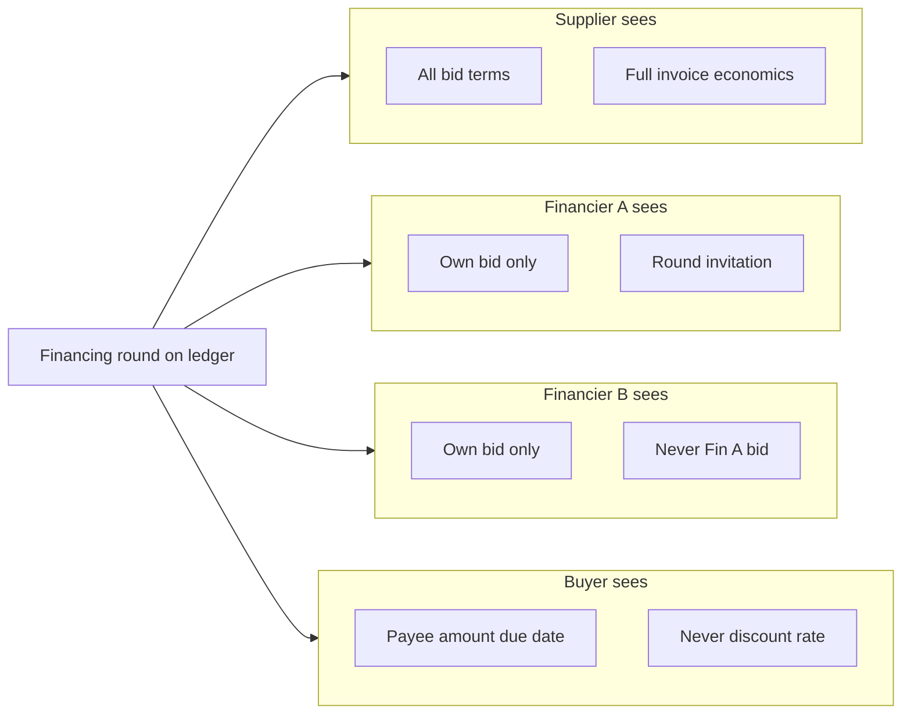

Each subgraph is a separate ledger view — not one database with column-level ACLs.

### Technical Innovations

**1. Interface-view privacy** — One receivable, six typed projections (buyer, supplier, financier, lead, participant, regulator). Privacy is assigned at design time, not configured in the UI.

**2. Sealed-bid + oracle pricing** — Private auction rooms with one bid per financier. Bids anchor to a fresh reference rate inside the supplier's band; stale feeds pause the round or switch to a labeled fallback.

**3. Atomic DvP at award** — Bid acceptance, payee reassignment, MUSD transfer, and settlement audit record in one commit. Partial outcomes are impossible.

**4. Pass-through syndication** — Participation interests sell economic rights to repayment; payee stays with the lead; waterfall splits proceeds on-ledger at maturity.

**5. Mandate-gated agents** — Financiers may delegate bidding to an AI agent, but risk limits live on the ledger. Out-of-mandate bids fail at the contract, not in agent code.

### Interface Views and Selective Disclosure

Each portal authenticates as one party and renders only that party's ledger entitlement — not redacted copies of a shared database.

| View | Answers | Withheld |
|------|---------|----------|
| **Buyer** | Who to pay, how much, when | Discount, financing, syndication |
| **Supplier** | Full economics and bid history | — |
| **Financier** | Invitation and headline terms | Other financiers' bids |
| **Lead** | Syndication cap table | — |
| **Participant** | Own slice | Others' entry prices |
| **Regulator** | Aggregate exposure | Per-trade commercial detail |

Each arrow is a separate interface projection — parties never download the full receivable and filter locally.

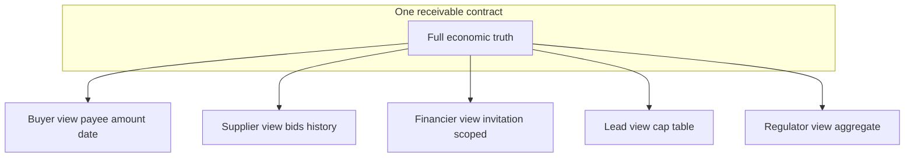

### System overview

Commands flow inward (portal → coordination → ledger); read models flow outward (ledger events → indexer → portal). The ledger is the only source of truth.

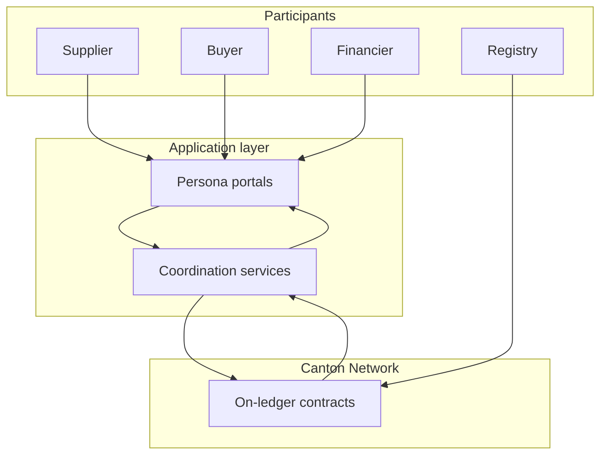

Participants never talk to Canton directly — portals and coordination services mediate every read and write.

---

## The Problem

### Invoice Privacy Is Broken Everywhere

Invoice financing still runs on email, PDF, and spreadsheets. **Privacy failures destroy market economics:** visible bids collapse price discovery; exposed buyer relationships create leverage risk; financiers won't share rate books but need credit signal; everyone needs assignment and payment to change together at funding.

Post-funding, financiers want to syndicate exposure without involving the buyer or revealing participant pricing to each other.

### Why Existing Approaches Fail

| Approach | Privacy model | Settlement | Verdict |
|----------|---------------|------------|---------|
| Email / PDF factoring | Centralized, breachable | Manual reconciliation | No trust minimization |
| Public blockchain | Full transparency | Atomic transfer possible | Destroys bid secrecy and buyer privacy |
| Private consortium database | Operator sees all | Bilateral APIs | No interoperability; platform risk |
| Generic tokenized receivables | Varies | Token transfer ≠ assignment | Domain logic missing |

Canton targets **privacy and atomic multi-party workflow together** — the combination generic approaches miss.

### The Gap Meridian Fills

| Market requirement | Meridian response |
|--------------------|-------------------|
| Sealed bids | Observer-scoped bid contracts — not UI hiding |
| Buyer never sees discount | Buyer interface view omits all financing economics |
| Atomic assignment + cash | Single commit at award and at syndicated repayment |
| Oracle-linked pricing | Bids rejected if oracle stale; labeled fallback if feed down |
| Private syndication | Participation interests; buyer/supplier not observers |
| Institutional topology | Settlement finality recorded honestly per topology |
| Wallet interoperability | CIP-56 MUSD and participation metadata |

---

## The Solution

### Supplier obtains financing

1. **Issue and co-sign** — Supplier proposes; buyer co-signs with assignment consent. A **receivable** is issued. Buyer sees amount, due date, payee only.
2. **Post for bid** — Receivable marked ready for financing.
3. **Open round** — Supplier invites financiers, sets pricing band and deadline. Only invitees see the round.
4. **Sealed bidding** — Financiers submit oracle-anchored bids. Supplier ranks by effective rate; competitors never see each other's terms.
5. **Award and cash** — One transaction: bid closes, payee → financier, MUSD → supplier, settlement audit record written.
6. **Maturity** — Buyer repays; supplier receives **repayment proof**.

*Supplier sees full economics throughout. Buyer never sees bid terms. Financiers never see competitor bids.*

### Buyer fulfills an obligation

Co-sign at issuance → **obligations dashboard** (amount, due date, payee — no discount or syndication) → **repay** payee-of-record in MUSD at maturity. Financing economics are absent from buyer views, APIs, and event streams — not just hidden in the UI.

### Financier bids and wins

Invitation with anonymized buyer context → manual or **agent-assisted bid** anchored to SOFR → win/loss revealed only at award settlement → optional syndication as lead.

### Financier syndication

Lead opens **syndication offering** → participants submit sealed yield bids → lead awards slices → **waterfall** splits repayment on-ledger. Buyer and supplier learn nothing new.

### Institutional buyer and cross-domain settlement

When buyers or registries sit on **private synchronizers**:

- Financing and award stay **atomic** on the shared network.
- Buyer notice crosses domains via Canton **reassignment** (not off-chain messaging).
- Trades label **reassignment-mediated** or **escrow-fallback** honestly — never oversold as fully atomic.

### Ledger guarantees

- Atomic multi-party commit at award, syndication award, and syndicated repayment
- Sealed bids enforced by ledger observers
- Non-silent oracle degradation (paused / labeled fallback)
- Immutable settlement finality classification

### Why Canton is load-bearing

| Canton property | What it enables for Meridian |
|-----------------|------------------------------|
| Parties, not addresses | Institutional identities with hosted participant nodes |
| Sub-transaction privacy | Invited-only observers on financing and syndication rooms |
| Atomic multi-party commit | DvP, payee reassignment, waterfall without reconciliation jobs |
| CIP-56 token standard | MUSD discoverable by compliant wallets; allocation-based DvP |
| Network of networks | Cross-synchronizer reassignment and honest finality labels |

### Settlement finality — what treasury should understand

| Classification | Meaning for risk | When it applies |
|----------------|------------------|-----------------|
| **Atomic** | Single synchronizer; one commit settles assignment and cash | Default when all parties share a domain |
| **Reassignment-mediated** | Core trade atomic on shared network; buyer notice crosses domains | Buyer on private synchronizer |
| **Escrow-fallback** | Bounded escrow with timeout | Registry on distinct synchronizer |

Finality labels are immutable on the audit record and shown wherever a trade appears.

---

## Architecture

### Layered system design

| Layer | Responsibility |
|-------|----------------|
| **On-ledger (Daml)** | Issuance, bidding, award, syndication, repayment, mandates, audit |
| **Participant nodes** | Per-institution Canton parties |
| **Coordination / read** | Indexers, oracle relay, notifications, onboarding — rebuildable, no ledger authority |
| **Persona portals** | Supplier, buyer, financier, ops — party-scoped views only |

Commands go portal → coordination → ledger; reads go ledger → indexer → portal.

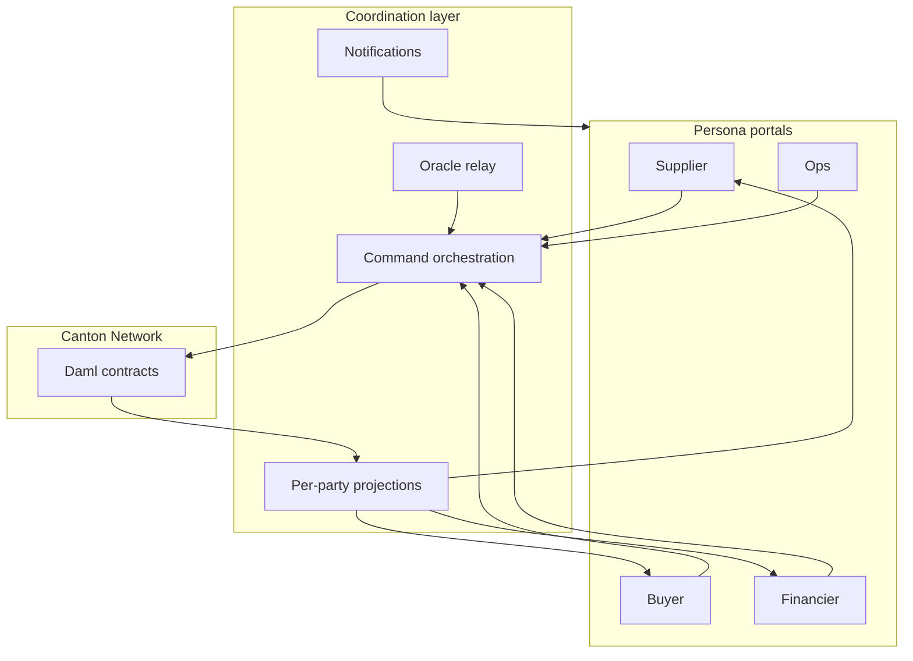

Each portal talks only to coordination services for its organization; only the ledger holds authoritative contract state.

### End-to-end financing sequence

Happy path from invoice creation through cash advance — each arrow is a ledger commit or projection update.

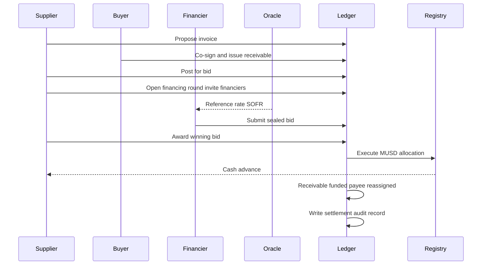

When the supplier awards, the ledger validates round state, deadline, bid ownership, oracle anchor, and MUSD amount before payee changes and cash moves.

### Syndication and waterfall sequence

After funding, the lead syndicates to invited participants. The buyer is not an observer — payee stays with the lead until maturity, when one repayment triggers a contract-enforced waterfall.

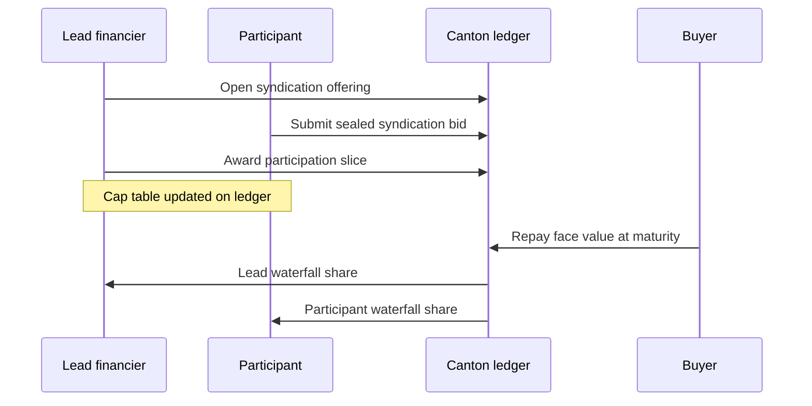

The lead sees the full cap table; each participant sees only their slice. Buyer and supplier observe no syndication contracts.

### Repayment and proof-of-payoff

Buyer pays the **current payee-of-record**. Syndicated receivables split proceeds in one transaction; the buyer still performs one repayment action.

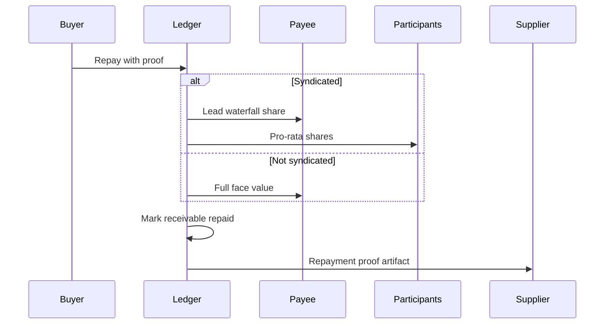

The **repayment proof** lets the supplier prove payoff without contacting the buyer.

### Oracle anchoring and fallback

Each bid must cite a fresh oracle report within the supplier's pricing band. Stale feeds pause the round; prolonged outage may switch to a **labeled static fallback** — never silent manual pricing.

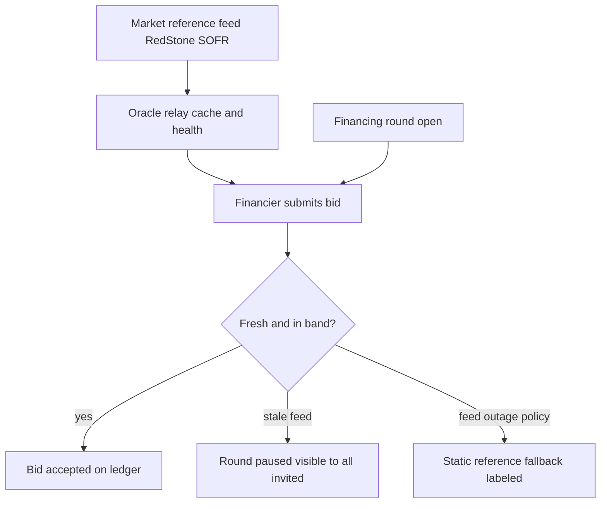

Invited financiers always see when a round is paused or in fallback mode.

### Sealed-bid privacy between financiers

Both financiers observe the round but receive **disjoint bid contracts** — Financier B's node never stores Financier A's bid.

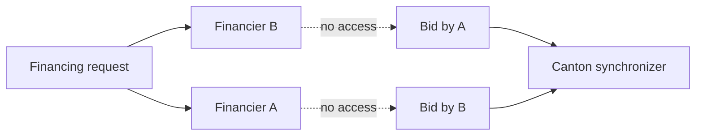

Privacy comes from Canton's encrypted view distribution, not portal ACL configuration.

### Interface-view scoping on one receivable

One contract, multiple projections — each party queries only its interface:

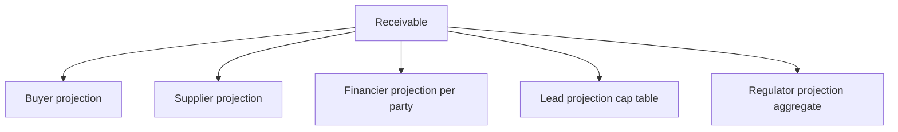

### Receivable lifecycle

States track the invoice from issuance through funding, optional syndication, and terminal outcomes:

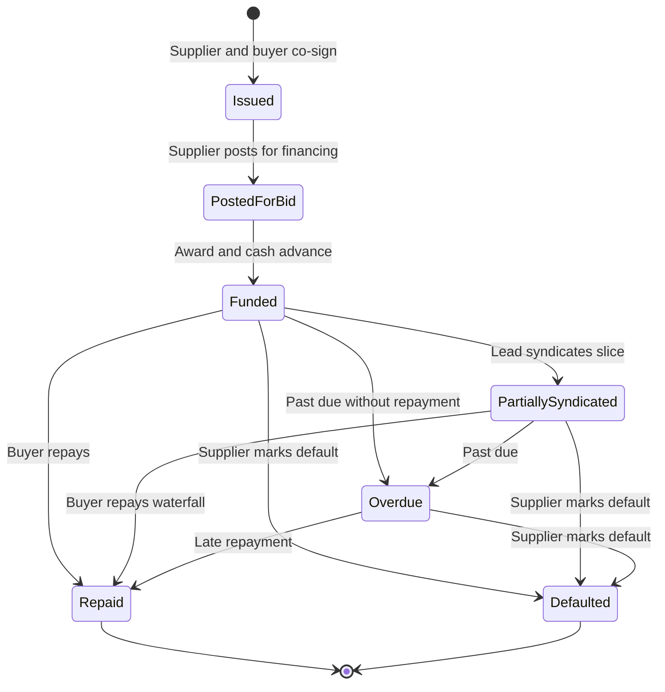

| State | Meaning |
|-------|---------|
| **Issued** | Valid tokenized invoice; not yet offered for financing |
| **PostedForBid** | Supplier may open a financing round |
| **Funded** | Winning financier is payee-of-record; advance paid |
| **PartiallySyndicated** | Lead sold participation; cap table active |
| **Repaid** | Buyer satisfied obligation; proof available |
| **Overdue** | Due date passed; payee notified — no collections logic |
| **Defaulted** | Supplier marked credit event |

Suppliers see **Funded** when syndicated internally — not cap-table detail.

### Financing round lifecycle

A round starts open for bids, may pause on oracle issues, and ends in award or expiry:

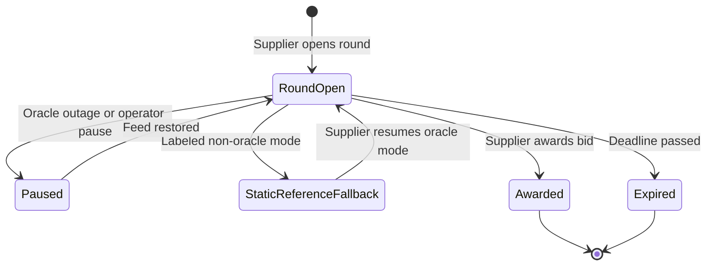

**Paused** and **StaticReferenceFallback** are visible to all invitees — financiers know when oracle pricing is unavailable. **Awarded** and **Expired** are terminal; no further bids accepted.

### Indexer and read models

Each org replays **only its party's** ledger stream into local dashboards. Indexers rebuild from the stream if lost — they never invent or cross-merge org data.

The append-only log is the rebuild source; portal dashboards are disposable projections.

### Coordination services — roles in the product

| Service | What it does for users |
|---------|------------------------|
| **Command orchestration** | Turns portal actions into ledger commands; holds no independent authority over financing outcomes |
| **Per-party indexers** | Supply supplier bid-comparison, buyer obligations, financier inboxes, ops finality panels |
| **Oracle relay** | Keeps reference rates fresh; exposes health for ops when feeds degrade |
| **Notifications** | Pushes issuance, invitation, award, and repayment events to connected portals in real time |
| **Agent runtime** | Polls financier inbox, proposes bids within mandate; ledger rejects out-of-policy bids |
| **Onboarding gate** | KYB verification must complete before new parties allocate on the network |
| **Registry API** | Lets external wallets discover MUSD metadata and holdings under CIP-56 |

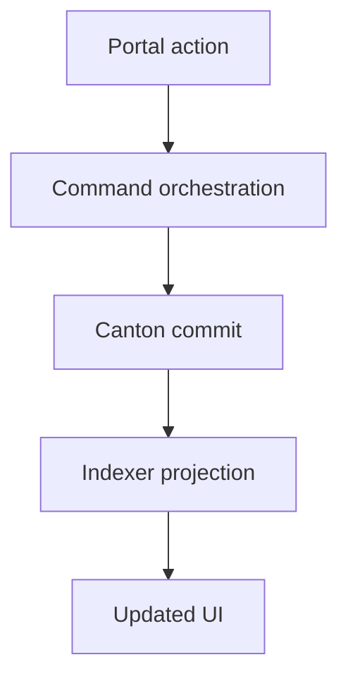

This round-trip applies to every portal action — issue, bid, award, repay. Notifications can push events before the user refreshes.

---

## On-Ledger Model

Domain objects on the ledger — what they mean, who authorizes them, and what each party learns.

### Receivable and proposal

Tokenized invoice (line items, face value, due date, payee, lifecycle). Supplier proposes; buyer co-signs to issue. Lifecycle: issued → posted → funded → repaid / overdue / defaulted. Buyer sees payee and amount only; supplier sees full economics; financiers see invitation-scoped fields.

### Assignment consent policy

Standing buyer permission to assign at award without being online — required for atomic payee change when cash moves.

### Financing request and bid

Private auction room per receivable: invitees, pricing band, deadline, oracle reference. One sealed bid per financier, oracle-fresh, within band. Agent bids must satisfy an active mandate. Only financier + supplier observe each bid.

### Award and settlement

Single transaction: validate round and bid → MUSD transfer → payee reassignment → close all bids → write settlement audit record. No gap between assignment and cash.

### MUSD and the cash leg

Tokenized cash (CIP-56) for advances and repayments. Registry mints MUSD and publishes allocation factories so DvP runs on the same ledger as the receivable.

### Repayment and proof-of-payoff

Buyer pays payee-of-record; syndicated deals waterfall in one commit. **Repayment proof** (payer, payee, amount, timestamp) goes to the supplier — no financing fields exposed to the buyer.

### Syndication offering and participation interest

Sealed-bid room to sell pass-through slices of a funded position. Payee stays with lead; cap table on lead view; participants see own slice only. Waterfall enforces pro-rata splits at repayment.

### Settlement audit record

Immutable finality label: atomic, reassignment-mediated, or escrow-fallback — shown on all persona and ops surfaces.

### Bidding mandate and agent

On-ledger limits: max exposure, min spread, eligible suppliers, agent-enabled flag. Every agent bid must satisfy the mandate or the ledger rejects it.

### Regulator and compliance views

Jurisdiction-scoped observer grants for aggregate exposure — never per-trade commercial detail.

### Validation pipelines

**Bid:** invited → round open → no duplicate bid → oracle fresh → in band → mandate OK (if agent) → create bid.

**Award:** round open → bid valid → MUSD matches → transfer → fund receivable → close bids → audit record → round awarded.

**Repayment:** funded/overdue → face value → buyer sender → waterfall if syndicated → repayment proof → repaid.

**Syndication award:** offering open → bid valid → lead is payee → share within cap → participation interest created.

### Artifacts users rely on

**Settlement audit record** — how final was settlement? **Repayment proof** — was the invoice paid, by whom, when?

---

## Daml Contracts

All business rules live in Daml across three packages: **`meridian-receivable`** (invoices, financing, syndication, settlement), **`meridian-cash`** (MUSD under CIP-56), and **`meridian-core`** (party onboarding anchor). Portals and services submit **choices** on these templates — they do not reimplement the logic off-ledger.

### Contract inventory

| Package | Template / interface | Product role |
|---------|---------------------|--------------|
| `meridian-receivable` | `ReceivableProposal` | Draft invoice awaiting buyer co-sign |
| | `Receivable` | Tokenized invoice — lifecycle, payee, cap table |
| | `AssignmentConsentPolicy` | Standing buyer consent to assign at award |
| | `FinancingRoundFactory` | Supplier opens a financing round |
| | `FinancingRequest` | Sealed-bid auction room |
| | `Bid` | One financier's sealed primary-market bid |
| | `BiddingMandate` | On-ledger risk limits for agent bidding |
| | `SyndicationFactory` | Lead opens a syndication round |
| | `SyndicationOffering` | Sealed-bid syndication room |
| | `SyndicationBid` | One participant's sealed syndication bid |
| | `ParticipationInterest` | Pass-through slice of repayment proceeds |
| | `RepaymentProof` | Supplier-facing proof of buyer payoff |
| | `SettlementAuditRecord` | Immutable settlement finality label |
| | `RegulatorJurisdictionGrant` | Maps regulator to jurisdiction |
| | `IBuyerView` … `IRegulatorView` | Typed privacy projections on receivables |
| `meridian-cash` | `CashRegistry` | MUSD mint and factory bootstrap |
| | `MusdRules` | CIP-56 transfer and allocation factories |
| | `MusdHolding` | Fungible MUSD balance |
| | `MusdAllocation` | Locked DvP leg at award / repayment |
| | `MusdTransferOffer` | Free transfer pending receiver accept |
| | `MergeHoldingsStub` | Placeholder for holding-merge tooling |
| `meridian-core` | `PartyRegistry` | KYB-gated party allocation record |

### Receivable domain

**ReceivableProposal** — Draft invoice created by the supplier. **Signatory:** supplier. **Observer:** buyer. **Key choices:** `CoSignAndIssue` (buyer issues live receivable after consent check), `Withdraw` (supplier cancels). Resolves assignment consent inline or via a linked policy before creating `Receivable`.

**Receivable** — The tokenized invoice: line items, face value, due date, lifecycle state, payee-of-record, invited financiers, syndication cap table, bid history. **Signatories:** supplier and buyer. **Observers:** current payee, platform operator, compliance observers. Implements six interface views (see below). **Key choices:** `PostForBid`, `ApplyFunding` (payee change at award), `RepayWithProof` (buyer payment + optional waterfall), `MarkOverdue`, `MarkDefaulted`, `ApplySyndication`.

**AssignmentConsentPolicy** — Master-agreement standing permission for the supplier to assign without the buyer online at award. **Signatory:** buyer. **Observer:** supplier. **Key choices:** `Revoke`. Referenced from receivable `consentSource` at issuance.

### Financing domain

**FinancingRoundFactory** — Per-supplier helper to open rounds against posted receivables. **Signatory:** supplier. **Key choice:** `OpenRound` — validates receivable is `PostedForBid`, sets invited financiers, creates `FinancingRequest`.

**FinancingRequest** — Private auction room: invitees, pricing band, deadline, oracle feed ID, round state, active bid map. **Signatory:** supplier. **Observers:** invited financiers only. **Key choices:** `SubmitBid`, `ReplaceBid`, `AwardBid` (atomic DvP + funding + audit record), `PauseRound`, `EnterStaticReferenceFallback`, `ExpireRound`.

**Bid** — One financier's sealed offer: advance, discount rate, oracle anchor, optional agent/mandate reference. **Signatory:** financier. **Observer:** supplier only — other financiers never see this contract. **Key choices:** `Withdraw`, `SupplierClose` (on award or round end).

**BiddingMandate** — Risk envelope for automated bidding: max exposure, min spread, eligible suppliers, agent-enabled flag. **Signatory:** financier. **Key choices:** `Revoke`, `UpdateConstraints`, `SetAgentEnabled`. Referenced when `FinancingRequest.SubmitBid` is called with `viaAgent = true`; `MandateValidation` rejects out-of-policy bids at the ledger.

### Syndication domain

**SyndicationFactory** — Per-lead helper to open syndication against funded positions. **Signatory:** lead financier. **Key choice:** `OpenOffering` — requires lead is payee-of-record and receivable is `Funded` or `PartiallySyndicated`.

**SyndicationOffering** — Secondary sealed-bid room: invited participants, pricing band, deadline, active syndication bid map. **Signatory:** lead. **Observers:** invited participants only — buyer and supplier are never observers. **Key choices:** `SubmitBid`, `ReplaceBid`, `AwardBid` (creates `ParticipationInterest`, updates receivable cap table).

**SyndicationBid** — One participant's sealed slice offer: share basis points, discount/yield, oracle anchor. **Signatory:** participant. **Observer:** lead only. **Key choices:** `Withdraw`, `LeadClose`.

**ParticipationInterest** — Pass-through economic right to a pro-rata share of repayment (`legalNature = pass-through-proceeds`). **Signatories:** lead and participant. Does **not** change payee-of-record. Implements `IParticipantView` so participants see only their slice.

### Settlement, repayment, and compliance

**RepaymentProof** — Immutable payoff artifact after buyer repayment. **Signatories:** payer and payee. **Observer:** supplier. Fields: amount, currency, timestamp, settlement reference — no financing economics.

**SettlementAuditRecord** — Written at award. **Signatories:** supplier and winning financier. **Observer:** platform operator. Records `SettlementFinality` (`Atomic`, `ReassignmentMediated`, `EscrowFallback`) without commercial pricing — ops monitors finality, not bid terms.

**RegulatorJurisdictionGrant** — Links a regulator party to a jurisdiction. **Signatory:** platform operator. **Observer:** regulator. **Key choice:** `Revoke`. Used with receivable `complianceObservers` for aggregate exposure views.

### MUSD and CIP-56 cash (`meridian-cash`)

**CashRegistry** — Registry bootstrap. **Signatory:** admin (registry party). **Key choices:** `MintHolding`, `CreateTransferFactory`, `CreateAllocationFactory` (both deploy `MusdRules`).

**MusdRules** — Implements CIP-56 **TransferFactory** and **AllocationFactory** for MUSD. Consumes input holdings, creates transfer offers or locked allocations used in award and repayment DvP legs.

**MusdHolding** — Standard fungible MUSD balance. **Signatory:** registry admin. **Observer:** owner. Implements CIP-56 `Holding`.

**MusdAllocation** — Locked cash leg for atomic settlement. **Signatories:** sender and registry admin. **Observer:** settlement executor. Implements CIP-56 `Allocation` — `executeTransfer` releases MUSD to receiver when the receivable choice settles.

**MusdTransferOffer** — Free-of-payment transfer pending receiver acceptance. Used for wallet-style MUSD moves outside DvP award/repay flows.

**MergeHoldingsStub** — Placeholder for future holding-consolidation tooling (roadmap: merge at scale).

### Topology (`meridian-core`)

**PartyRegistry** — On-ledger anchor that a party was KYB-verified and allocated with an organizational role (`Supplier`, `Buyer`, `Financier`, `Registry`, etc.). **Signatory:** platform operator. **Key choices:** `RegisterParty`, `UpdateJurisdiction`. Does not hold financing state — audit trail for onboarding.

### Interface views (privacy projections)

These are not standalone business contracts; they define what each party **may query** from a `Receivable` or `ParticipationInterest`:

| Interface | Implemented on | Exposes |
|-----------|----------------|---------|
| `IBuyerView` | `Receivable` | Payee, face value, due date |
| `ISupplierView` | `Receivable` | Full economics, bid history, lifecycle |
| `IFinancierView` | `Receivable` | Invitation status, headline terms if invited |
| `ILeadFinancierView` | `Receivable` | Full syndication cap table |
| `IParticipantView` | `ParticipationInterest` | Own share basis points |
| `IRegulatorView` | `Receivable` | Jurisdiction, aggregate exposure |

A party calling `fetchView @IBuyerView` on a receivable receives only buyer-scoped fields — the mechanism behind buyer privacy in the product.

---

## Off-Ledger and Application Layer

Portals act; off-ledger services coordinate and project — they do not override the ledger.

### Supplier portal

Issue invoices, open rounds, compare sealed bids, award, track portfolio and repayment proofs.

### Buyer portal

Co-sign, view obligations, repay — built on the buyer interface view (no financing leakage).

### Financier desk

Deal inbox, manual or agent bids, mandate configuration, positions, syndication as lead or participant.

### Ops and compliance console

Settlement finality, oracle health, regulator grants, KYB status. Operator **cannot** see individual bid terms or syndication entry prices.

### AI bidding agent

Financiers can enable an **automated bidding agent** that watches the deal inbox and submits sealed bids on their behalf. The agent uses an LLM (Groq on DevNet) to evaluate each invitation — face value, pricing band, SOFR reference, mandate limits — and returns a structured bid proposal (advance amount, discount rate, rationale).

**The agent has no independent authority.** Risk limits live in an on-ledger **bidding mandate** (max exposure, minimum spread, eligible suppliers). Before any agent bid is accepted, the ledger validates mandate constraints. A buggy, compromised, or adversarial agent cannot exceed those limits — rejection is a failed ledger transaction, not a polite refusal in agent code.

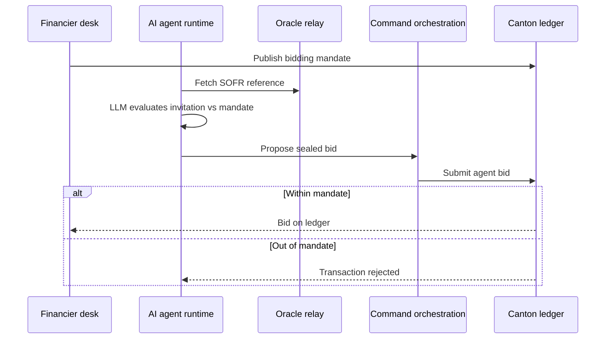

The financier desk configures mandates, enables the agent, and monitors an activity log. Manual bidding remains available alongside agent mode.

### How portals connect to the ledger

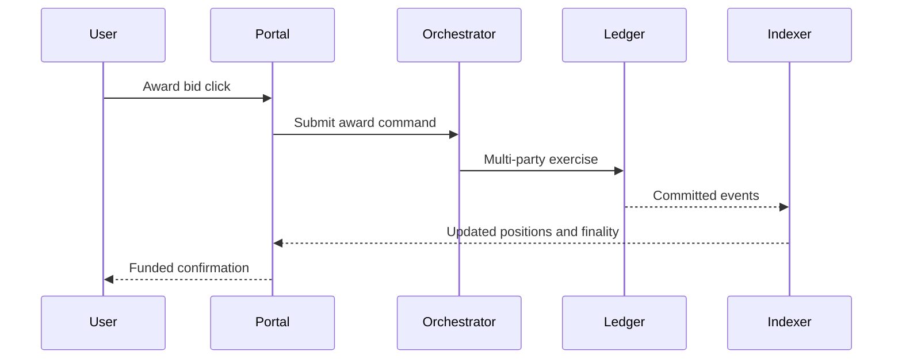

User click → ledger commit → indexer projection → updated UI. Same path for manual and agent-submitted bids.

---

## Roadmap

Building toward **institutional invoice financing and syndication on Canton** — privacy, atomic settlement, and honest finality labels under multi-validator topology.

### Cross-synchronizer settlement

Buyers and registries often sit on **private synchronizers** while suppliers and financiers share a network. Three topologies, each with an explicit label:

| Topology | Guarantee | Behavior |
|----------|-----------|----------|
| **Shared synchronizer** | Single-transaction atomic | Assignment + cash in one commit |
| **Buyer on private sync** | Reassignment-mediated | Core trade atomic; buyer notice crosses domains |
| **Registry on distinct sync** | Escrow-fallback | Bounded escrow with timeout when domains don't meet |

The first diagram shows how award, buyer notice, and cash legs can span synchronizers. The second shows deployment evolution toward per-institution MainNet.

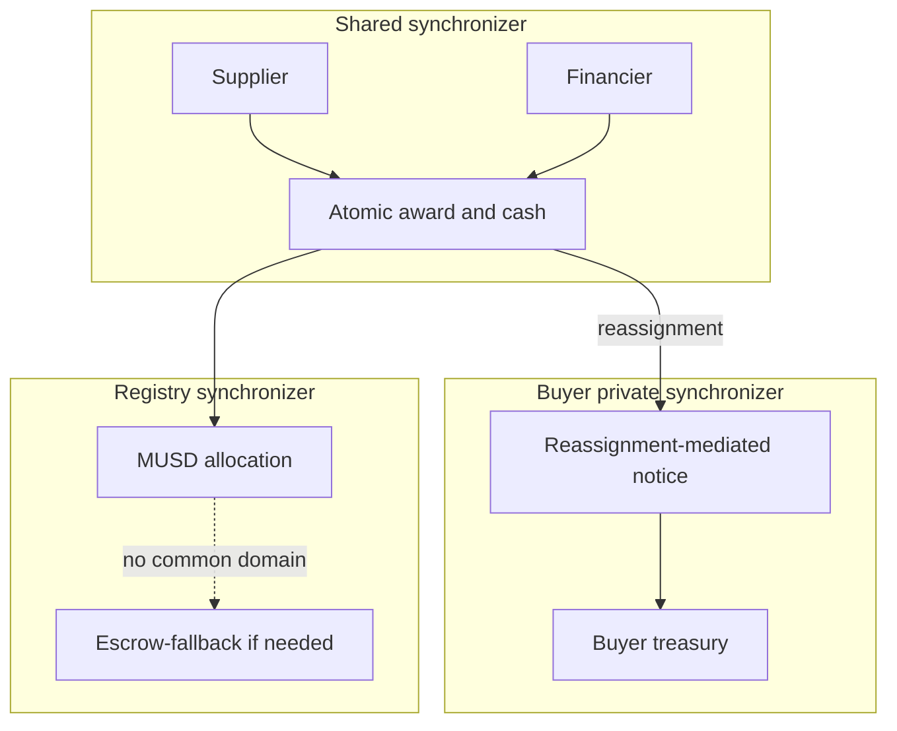

### What we are building next

- Multi-validator deployment and MainNet cutover
- Production KYB/AML integration
- Security review of all ledger authorization paths
- Load and performance validation
- Full visibility-matrix regression as release gate

---

## Conclusion

Meridian is a Canton-native exchange for **private invoice financing and syndication** — sealed bids, oracle-anchored pricing, buyer privacy, pass-through syndication, and atomic settlement with honest finality labels.

| Visible on Canton | Hidden from unauthorized parties |
|-------------------|----------------------------------|
| Payee and face value (buyer view) | Discount rate to buyer |
| Round existence (invitees only) | Competitor bid terms |
| MUSD settlement amounts | Syndication to buyer/supplier |
| Settlement finality class | Participant entry prices |
| Aggregate regulator exposure | Per-trade commercial detail |

**Contributions:** interface-view privacy · sealed primary/secondary markets · atomic CIP-56 DvP · on-ledger mandate enforcement · honest settlement audit.

Invoice financing needs **privacy and interoperability together**. Canton provides institutional parties, sub-transaction privacy, atomic multi-party commit, CIP-56 cash, and cross-domain reassignment — the combination public chains and private databases each fail to deliver alone.
